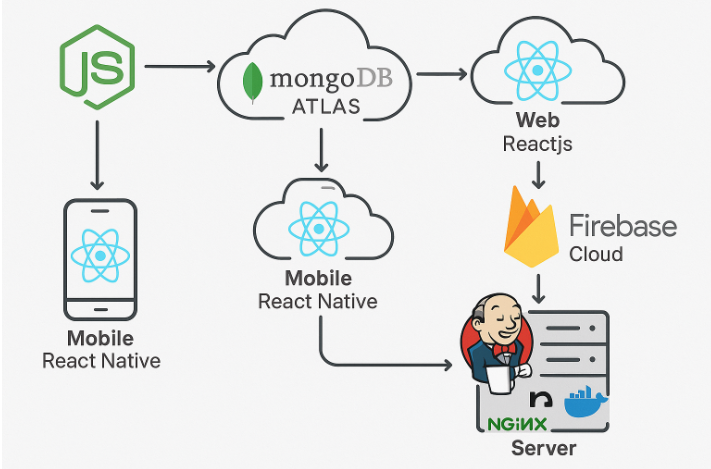
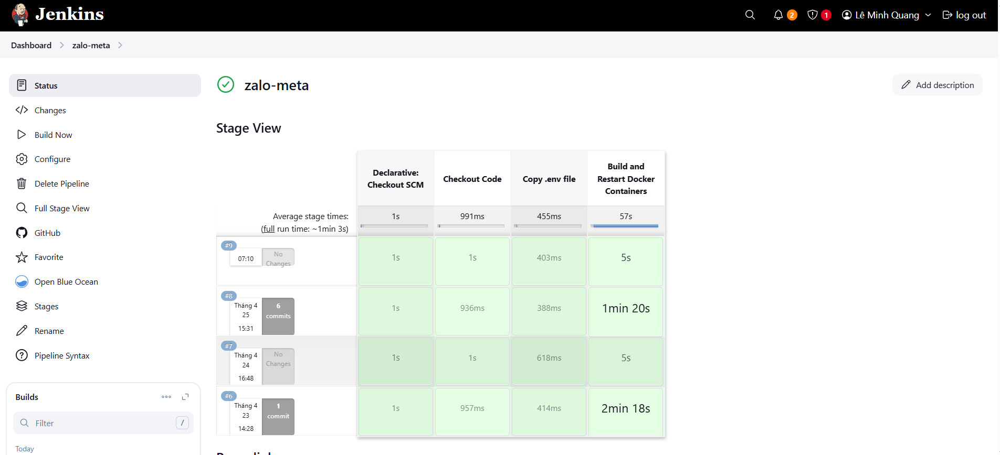
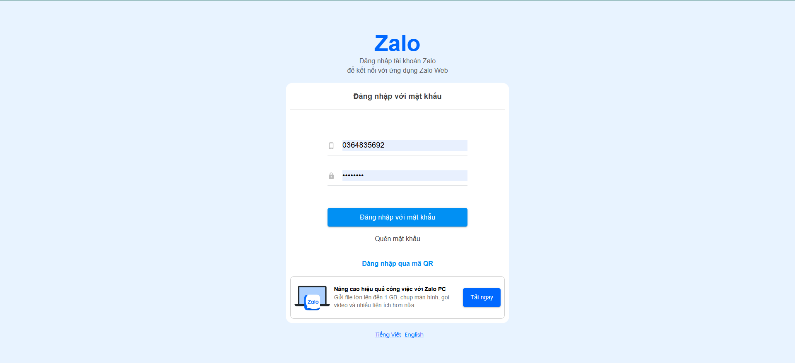
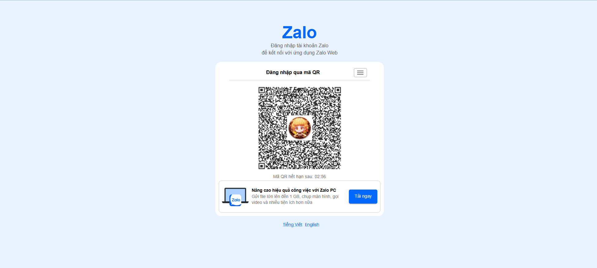
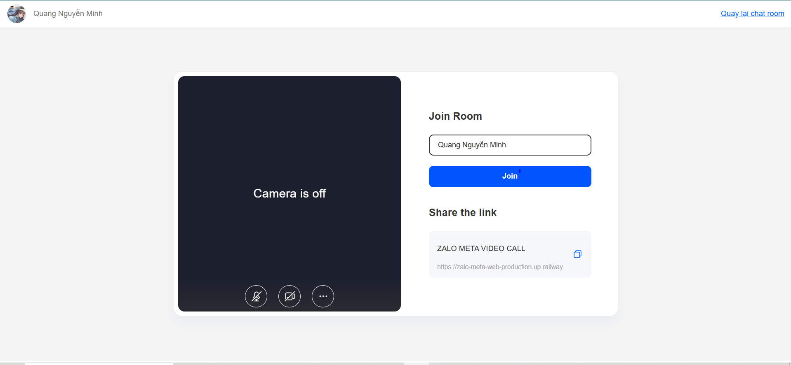
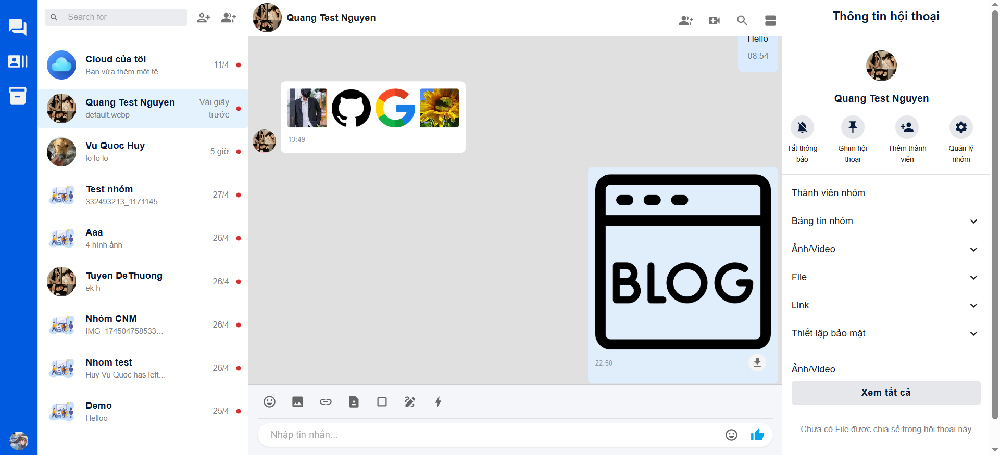
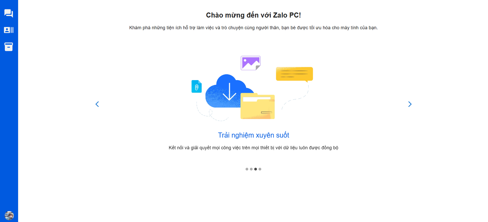
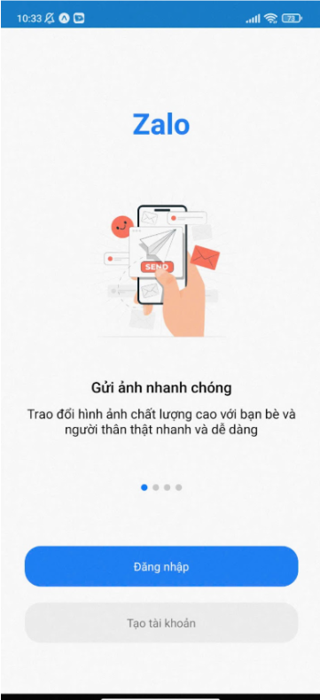
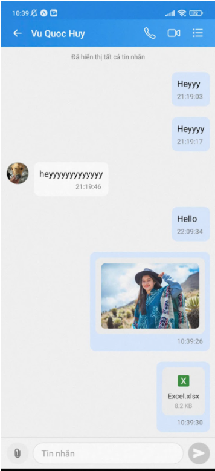

# Zalo Meta

Zalo Clone is a messaging and calling application designed to replicate the core features of the Zalo app. The project utilizes modern technologies to provide a real-time communication experience, including messaging, video calls, and QR code login.













## Features
Socket: Utilizes WebSocket for real-time communication between client and server, ensuring instant message and notification delivery.
Firebase Messaging: Integrates Firebase Cloud Messaging (FCM) to send push notifications for new messages.
Chat Room: Supports group chat rooms where multiple users can join and interact simultaneously.
Private Chat: Provides one-on-one messaging with a user-friendly interface.
Video Call: Integrates Zope for high-quality video calling between users.
QR Login: Allows users to log in quickly by scanning a QR code via the mobile app.
User Interface: Intuitive and user-friendly design inspired by Zalo.

- **Socket**: Utilizes WebSocket for real-time communication between client and server, ensuring instant message and notification delivery.
- **Firebase Notify Messaging**: Integrates Firebase Cloud Messaging (FCM) to send push notifications for new messages.
- **Chat Room**: Supports group chat rooms where multiple users can join and interact simultaneously.
- **Chat đơn**:  Provides one-on-one messaging with a user-friendly interface.
- **Call Video**:  Integrates Zope for high-quality video calling between users.
- **QR Login**: Allows users to log in quickly by scanning a QR code via the mobile app.
- **User Interface**: Intuitive and user-friendly design inspired by Zalo.

## Technologies Used

- **Frontend**: ReactJS, Tailwind CSS
- **Backend**: Node.js, Express.js
- **WebSocket**: Socket.IO
- **Database**: MongoDB
- **Push Notifications**: Firebase Cloud Messaging
- **Video Call**: Zope
- **Authentication**: JWT, QR Code, OAuth2
- **Hosting**: Cloud Server
- **Devops**: Jenkins, NGINX

## Setup project

### Requirement

- Node.js (>= v16)
- MongoDB (MongoDB Cloud Atlas)
- Firebase account (FCM)
- Zope Cloud (Chrome, Firefox, v.v.)

### Settings

1. **Clone repository**

   ```bash
   git clone https://github.com/Quindart/zalo-meta-web
   cd zalo-meta-web
   ```

2. **Setup dependencies**

   - Frontend:
     ```bash
     npm install
     ```

3. **Setup enviroment**

   - Create `.env`  file
     ```
     REACT_APP_API_URL=http://localhost:5000
     REACT_APP_SOCKET_URL=http://localhost:5000
     ```

4. **Running website**

     ```bash
     npm run dev
     ```

7. **Testing website**

   - Browser open at `http://localhost:3000`.

